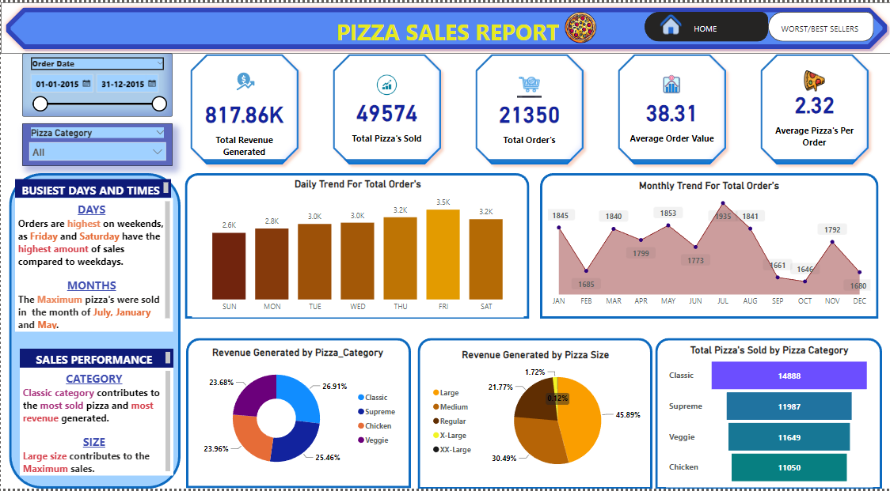

# Pizza Sales Project(POWER BI/ SQL)

---

## INTRODUCTION
This is Power BI project analysing the sales data of a pizza store for the year 2015. From the Dashboard we can see the different insights provided, which can help the company to build a stratergy for the upcoming year to increase their sales. Some important insights are the Revenue generated , most sold Pizza's, worst sold pizza, etc.

**_Disclaimer_:** _The Dataset used for this report is strictly used to demonstrate capabilities of Power BI._

## SKILLS/ CONCEPTS DEMONSTRATED:
DAX, POWER QUERY, QUICK MEASURE, PAGE NAVIGATION, MODELLING, FILTERS, BUTTONS

## PROBLEM STATEMENT
1) Find the Total Revenue, Average Order Value, Total Pizza Sold, Total Orders Placed and Average Pizza Per Order?
2) Find out daily and monthly trend for total order and also find out the sales percentage by pizza size and category?
3) List the top 5 and bottom 5 pizzas based on their sales on revenue and quantity.

## DASHBOARD(Problem 1/2)

## DASHBOARD(Problem 2)

## INSIGHTS
1) From the Dashboard 1 we can see taht the total revenue generated was 817.86k whereas the total orders placed were 21350k with an average order value of 38.31.

2) Weekends had the highest amount of sales and January, July and May were the busiest months. Classic category along with Large Size was the Best performing.
  
3) The Thai Chicken pizza was the highest interms of revenue generated and  Classic Deluxe Pizza was the highest in terms of quantity and total Order

