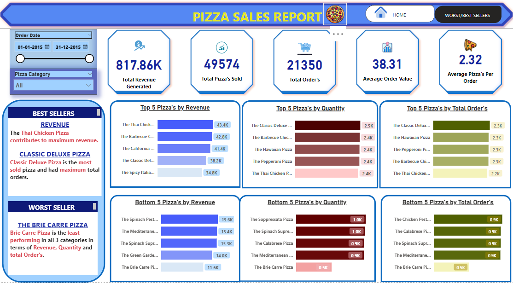

# Pizza Sales Project(POWER BI/ SQL)

---

## INTRODUCTION
This is Power BI project analysing the sales data of a pizza store for the year 2015. From the Dashboard we can see the different insights provided, which can help the company to build a stratergy for the upcoming year to increase their sales. Some important insights are the Revenue generated , most sold Pizza's, worst sold pizza, etc.

**_Disclaimer_:** _The Dataset used for this report is strictly used to demonstrate capabilities of Power BI._

## SKILLS/ CONCEPTS DEMONSTRATED:
DAX, POWER QUERY, QUICK MEASURE, PAGE NAVIGATION, MODELLING, FILTERS, BUTTONS

## PROBLEM STATEMENT
1) Find the Total Revenue, Average Order Value, Total Pizza Sold, Total Orders Placed and Average Pizza Per Order?
2) Find out daily and monthly trend for total order and also find out the sales percentage by pizza size and category?
3) List the top 5 and bottom 5 pizzas based on their sales on revenue and quantity.

## DASHBOARD(Problem 1/2)

